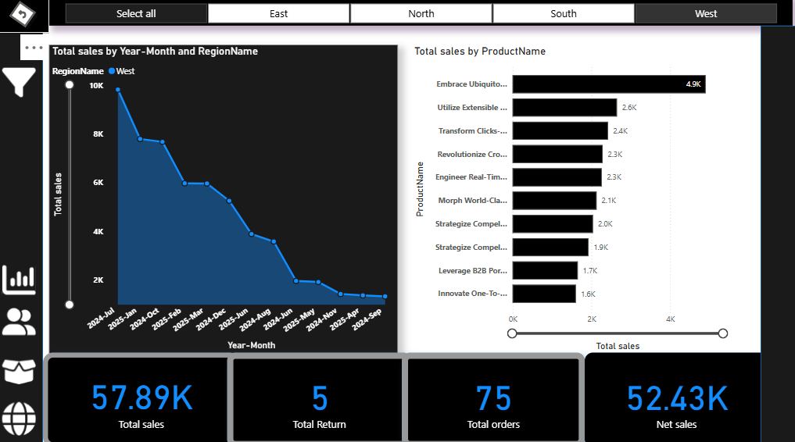

📊 Power BI Sales & Returns Analysis Dashboard
🔍 Project Overview

This Power BI project delivers a comprehensive sales and returns performance analysis using interactive dashboards. The objective of this project is to help business stakeholders monitor sales trends, evaluate product performance, track customer behavior, and analyze return reasons across regions and time periods.

The dashboards are designed with a dark professional theme, dynamic filters, and KPI cards to provide quick insights and support data-driven decision making.

### 📊 Sales Overview Dashboard

Explanation:
This dashboard provides a high-level sales performance overview across time,
regions, and products. It helps stakeholders quickly understand overall business
health and revenue trends.

What this dashboard shows:

📈 Total Sales Trend by Year–Month segmented by region

🛒 Top Products by Total Sales

📦 Key KPIs:

Total Sales: 57.89K

Total Orders: 75

Total Returns: 5

Net Sales: 52.43K

Business Insights:

Sales show a declining trend over months, highlighting seasonality or demand drop

Certain products contribute significantly more revenue than others

Regional filtering allows performance comparison across East, West, North, South

Business Value:
Helps management monitor revenue trends, identify top-selling products, and
detect early signs of declining performance.

### 🔁 Returns & Return Rate Analysis

Explanation:
This dashboard focuses on product returns analysis, helping identify quality,
logistics, and customer satisfaction issues.

What this dashboard shows:

🔄 Total Returns: 50

📉 Return Rate by Orders: 5%

📉 Return Rate by Sales: 100%

📆 Monthly Return Rate Trend

❗ Return Reasons Breakdown

Key Insights:

Late delivery is the top return reason

Return rates are declining over time, indicating operational improvement

Defective and wrong items are secondary causes

Business Value:
Supports quality control, supply chain optimization, and reduction of return-related
losses.

### 👥 Customer & Segment Performance Dashboard

Explanation:
This dashboard analyzes customer behavior, segment contribution, and individual
customer performance.

What this dashboard shows:

💰 Total Sales: 844.02K

👤 Average Sales per Customer: 4.26K

🧩 Orders by Customer Segment (Consumer, Corporate, Home Office)

🏆 Top Customers by Total Sales

📋 Detailed customer-level sales table

Key Insights:

Consumer segment contributes the highest share of orders

A small group of customers generates a large portion of revenue

High-value customers can be targeted for retention strategies

Business Value:
Enables customer segmentation, loyalty program design, and revenue maximization
through focused marketing.

## ⭐ Project Summary
This Power BI project demonstrates strong skills in **data modeling,
visual analytics, KPI design, and business storytelling**.  
The dashboards collectively help stakeholders monitor performance, reduce
returns, and improve customer profitability.

## 👨‍💻 About Me
**Tushar Vala**  
Aspiring Data Analyst | Fresher  

📧 Email: tusharvala707@gmail.com  
🌐 Portfolio: https://tushars-tech-canvas.lovable.app/

---

⭐ If you find this project useful, feel free to **star the repository**!
